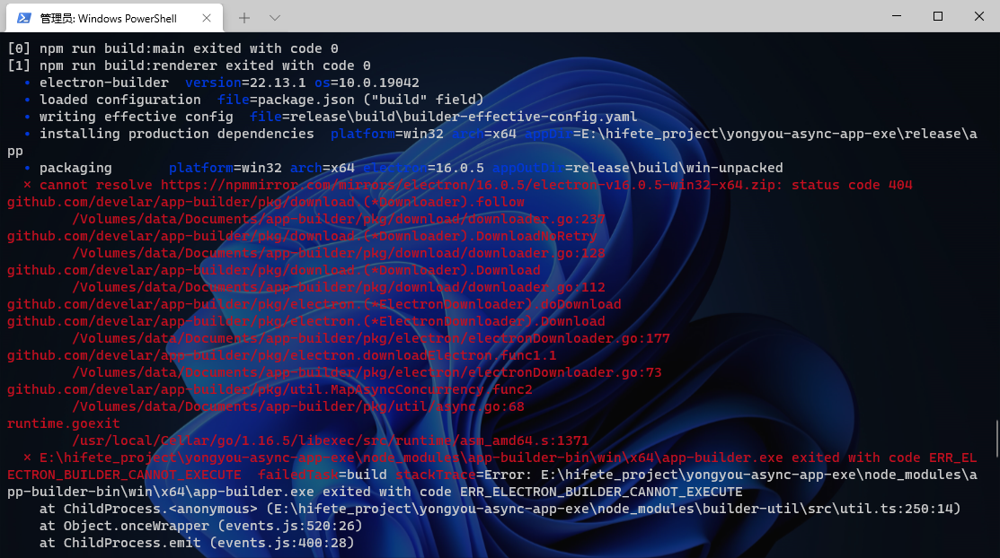
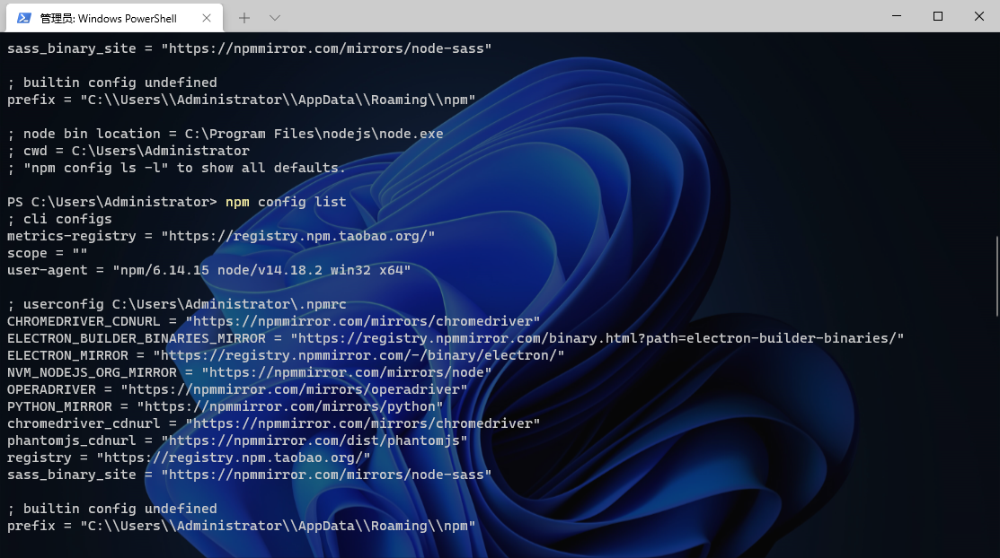

在使用electron开发模板 [electron-react-boilerplate](https://electron-react-boilerplate.js.org/)时，运行打包命令 `npm run package` 时出现错误：





<!--truncate-->


提示错误：

> cannot resolve https://npmmirror.com/mirrors/electron/16.0.5/electron-v16.0.5-win32-x64.zip: status code 404

链接访问出错，由此判断是npm镜像链接有问题

查看npm全局的配置信息：

```
npm config list
```

或者打开文件 `C:\Users\Administrator\.npmrc`



删除 `ELECTRON_MIRROR` 和 `ELECTRON_BUILDER_BINARIES_MIRROR` 两项配置，再使用npm代理 即可成功执行！
