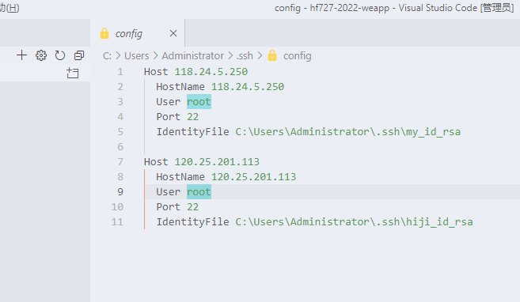
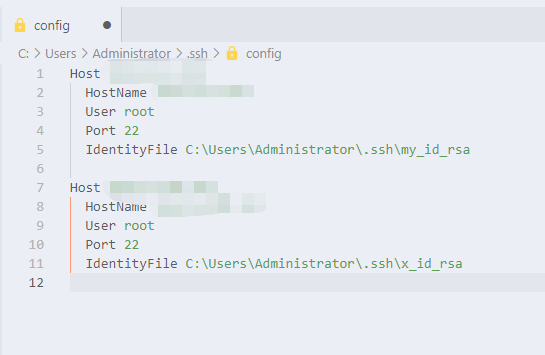

## 在服务器上生成 ssh 秘钥

1. 使用宝塔面板 ssh 管理器一键生成，生成目录 `/root/.ssh/`

2. 手动生成

```bash
ssh-keygen
```

确定保存路径按 Enter

```bash
Enter file in which to save the key (/home/andron/.ssh/id_rsa):
```

输入密码

```bash
Enter passphrase (empty for no passphrase):
```

再次输入密码

```bash
Enter same passphrase again:
```

## 复制私钥到本地

存放秘钥到本地 `C:\Users\Administrator\.ssh\` 目录，注意修改名称。

## 修改配置

点击设置按钮



选择配置文件，可配置每个服务器的连接信息


